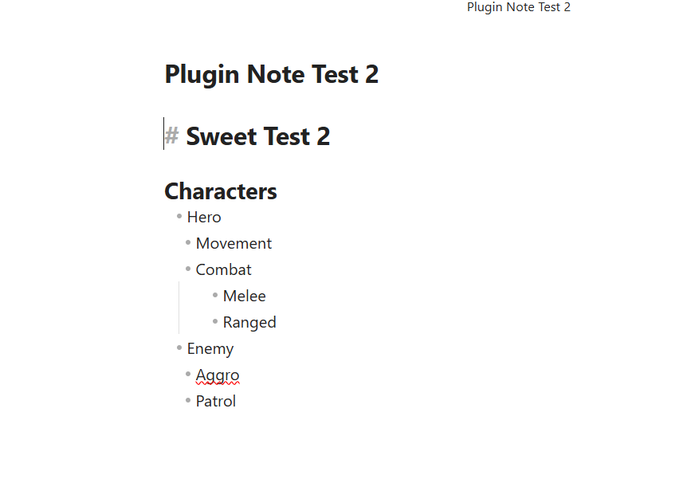
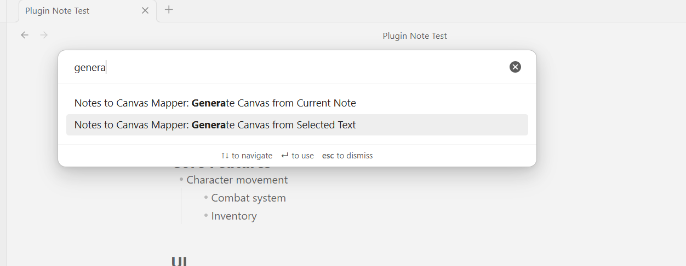
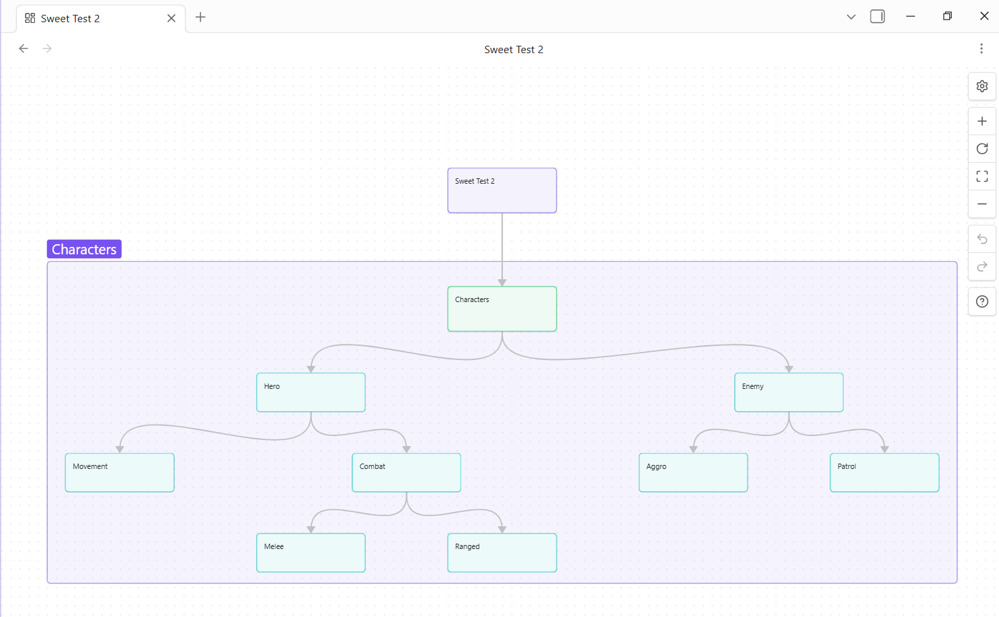
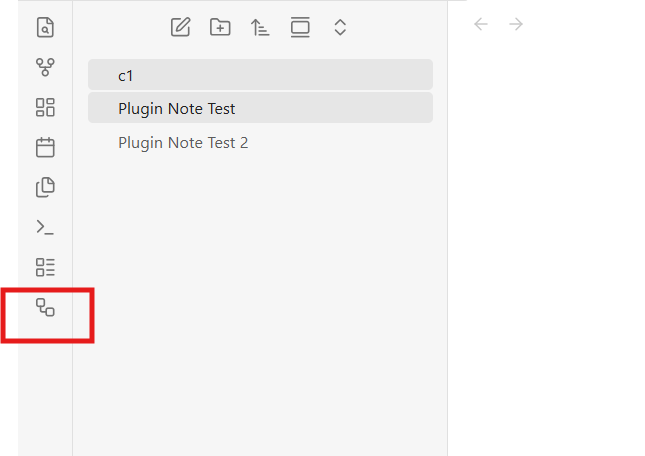

# Notes to Canvas Mapper

Convert structured notes into visual Obsidian Canvas maps.

Notes to Canvas Mapper helps turn long notes, AI-generated outputs, feature lists, plans, and grouped ideas into an editable visual layout inside **Obsidian Canvas**. Instead of scrolling through large blocks of text, you can generate a graph-like canvas with sections, child items, nested branches, and optional image nodes.

This plugin is especially useful for:

- project planning
- game design
- feature breakdowns
- system mapping
- AI output organization
- idea clustering
- visually grouping related content

---

## What the plugin does

The plugin reads structured Markdown and generates a native `.canvas` file inside your Obsidian vault.

It can currently map:

- document titles
- section headings
- bullet lists
- nested bullet lists
- selected text
- current note contents
- image embeds in supported formats
- section groups on the canvas
- node and group colors

The generated canvas remains editable in Obsidian, so you can still move nodes around manually after generation.

---

## Current features

- Generate Canvas from **Current Note**
- Generate Canvas from **Selected Text**
- Smart ribbon icon behavior
  - uses selected text if there is a selection
  - otherwise uses the current note
- Nested bullet support
- Basic image embed support
- Adjustable spacing and output settings
- Native Obsidian Canvas output
- Section grouping
- Node colors and group colors

---

## How to use the plugin

After enabling the plugin in Obsidian, you can run it in two ways:

### Option 1: Click the left sidebar ribbon icon

The plugin adds an icon to the **left sidebar**.

- If you click the icon while **text is selected** in the current note, the plugin generates a canvas from the **selected text only**.
- If you click the icon with **no text selected**, the plugin generates a canvas from the **entire current note**.

This is the fastest way to use the plugin.

### Option 2: Use the Command Palette

Open the Obsidian **Command Palette** and run one of these commands:

- **Generate Canvas from Current Note**
- **Generate Canvas from Selected Text**

On many systems, the Command Palette can be opened with:

- **Ctrl + P** on Windows/Linux
- **Cmd + P** on macOS

If you do not know the shortcut, you can also open the Command Palette from Obsidian’s interface.

### What happens after generation

When the plugin runs, it creates a new `.canvas` file in your vault and opens it in Obsidian. The generated canvas can then be adjusted manually if you want to improve spacing, move nodes, or rearrange groups.

---

## Screenshots

**Markdown note sample**




**Command Palette**




**Graph generated on the canvas from notes**



## 


**Plugin icon shown in the red box**



## 

## Best use cases

Notes to Canvas Mapper works best when the input note is already somewhat structured.

Examples:

- feature lists grouped by system
- game characters and their abilities
- UI breakdowns
- quest flow ideas
- plugin/module architecture
- project roadmaps
- AI-generated planning notes
- grouped design concepts

It is most effective when the note is written as a hierarchy rather than a loose stream of paragraphs.

---

# Supported Markdown structure

The plugin currently works best with the following structure.

## Title

Use a level-1 heading for the main root of the map:

```md
# My Project
```

This becomes the root node of the generated canvas.

## Sections

Use level-2 headings for major groups:

```md
## Core Features
## UI
## Future Ideas
```

These become section/group nodes under the root.

## Items

Use bullet lists under sections:

```md
## Core Features
- Character movement
- Combat system
- Inventory
```

These become child nodes under the section.

## Nested items

Use indented bullet lists for hierarchy:

```md
## Characters
- Hero
  - Movement
  - Combat
- Enemy
  - Melee
  - Ranged
```

These become deeper branches in the canvas.

## Images

Supported embed patterns include:

```md

![[hero.png]]
```

If the referenced file exists in the vault and resolves correctly, the plugin can create an image/file node for it.

---

# Recommended note format

This is the safest format to use for consistent results:

```md
# My Game Project

## Characters
- Hero
  - Movement
  - Combat
  - ![[hero.png]]
- Enemy
  - Melee
  - Ranged

## UI
- Main Menu
- Health Bar
- Inventory

## Future Ideas
- Skill Tree
- Crafting
- Quest Log
```

This style gives the plugin a clean structure to map.

---

# Recommended AI output format

When using AI-generated notes, ask for output in structured Markdown.

Use a prompt like this:

```txt
Generate the response in clean Markdown for Obsidian using:
- one # title
- ## section headings for major groups
- bullet lists for items
- nested bullets for sub-items
- keep it structured and compact
- avoid large paragraphs unless necessary
- use standard markdown bullets (-) for best compatibility
- if images are needed, use vault-style references such as ![[image.png]]
```

That will dramatically improve the quality of generated canvases.

---

# Human writing guidelines

To make notes map well:

## Do this

- use one clear `# Title`
- use `##` headings for major groups
- use `-` bullet points for items
- use consistent indentation for children
- keep each bullet as one idea
- group related items under one heading
- use image embeds only when needed

## Avoid this

- giant unstructured paragraphs
- random heading jumps
- mixing too many heading levels without purpose
- inconsistent indentation
- dumping disconnected thoughts without grouping
- using the note like a stream-of-consciousness scratchpad when you expect a clean canvas

The plugin can only map structure that is actually present.

---

# What happens when note formats differ?

This is important.

## If the note stays structurally similar

The plugin will usually still work fine.

For example, these often still work:

- different section names
- different item wording
- different project domains
- longer or shorter bullet contents

## If the note becomes less structured

The plugin may still generate a canvas, but the result may be weaker.

Example of weak input:

```md
# Project

This is a long paragraph with many ideas mixed together.
There are features, systems, characters, and future plans here,
but they are not broken into sections or bullets.
```

That may not map well because the parser does not deeply understand freeform prose.

---

# Supported list styles

For the cleanest and most reliable results, use this syntax:

## Officially recommended

- `#` for the document title
- `##` for major sections
- `- item` for list items
- indented `- item` for nested items

## Also commonly handled

The plugin may also handle:

- `* item`
- `+ item`

But for public-facing documentation and consistency, **dash bullets (`-`) should be treated as the preferred style**.

## Not officially supported yet

These are not guaranteed to produce reliable hierarchy:

- numbered lists like `1. item`
- alphabetic lists like `a. item`
- Roman numerals like `i. item`
- mixed outline styles in the same section

So yes, for consistency, users should follow a recommended structure. The plugin needs a predictable input grammar to give predictable output.

---

# Official recommended syntax contract

For the best results, notes should follow this pattern:

- one main `#` title
- `##` section headings for groups
- `-` dash bullets for nodes
- consistent indentation for nested nodes
- optional image embeds when needed

If users or AI follow that contract, the plugin will work much more smoothly.

---

# Example inputs

## Example 1 — Feature planning

```md
# Route Planner App

## Core Systems
- Route creation
- Task grouping
- Map markers

## UI
- Dashboard
- Calendar panel
- Task editor

## Future Ideas
- Team collaboration
- AI suggestions
- Mobile sync
```

## Example 2 — Game design

```md
# Action RPG

## Characters
- Hero
  - Movement
  - Combat
  - Skills
- Enemy
  - Melee
  - Ranged
  - Boss

## Systems
- Inventory
- Quest Log
- Crafting

## UI
- HUD
- Pause Menu
- Inventory Screen
```

## Example 3 — Plugin planning

```md
# Notes to Canvas Mapper

## Core Features
- Generate from current note
- Generate from selected text
- Nested bullet support

## Layout
- Smart spacing
- Compact mode
- Hierarchy mode

## Future Features
- Note link nodes
- Better image resolution
- Update existing canvas
```

---

# Troubleshooting

## Plugin loads but nothing appears

Use the ribbon icon in the left sidebar or the Command Palette.

- Clicking the ribbon icon uses the current note.
- If text is selected, the ribbon icon uses the selected text instead.
- The plugin does not open a separate panel. It generates a canvas file when you run it.

## Canvas is generated but spacing is imperfect

This can happen with uneven content sizes. The plugin does the bulk layout, but Canvas remains editable for final adjustment.

## Image block says file could not be found

Usually this means the image path or vault resolution did not match what Canvas expected. If the image exists in the vault and is placed correctly, drag-and-drop remains a valid fallback.

## Output looks too flat

Use nested bullet lists instead of a single flat list.

## Output is messy

The note is probably too unstructured. Break it into:

- one root title
- section headings
- bullet groups
- nested bullets where needed

---
