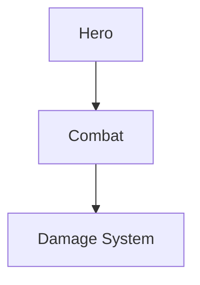
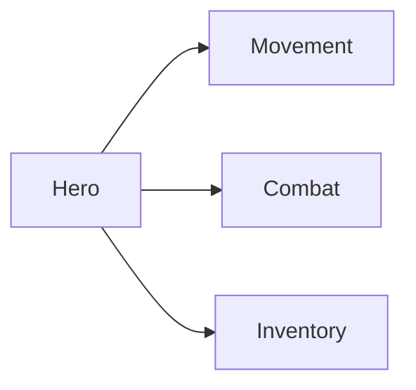
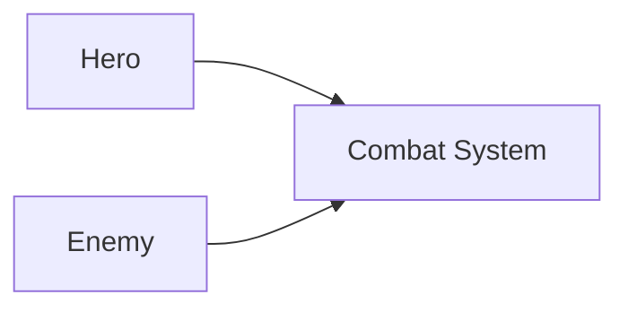
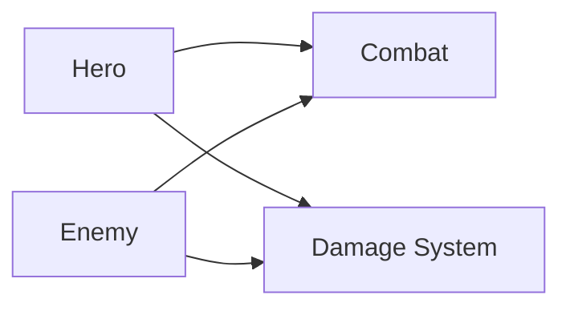
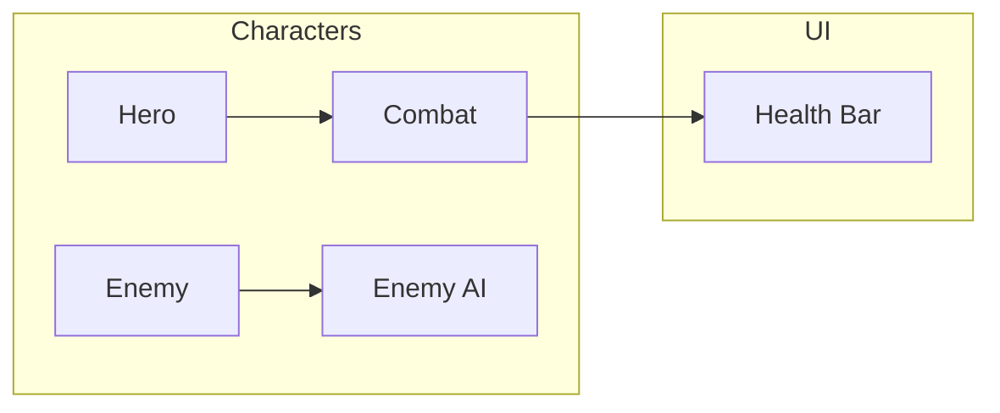
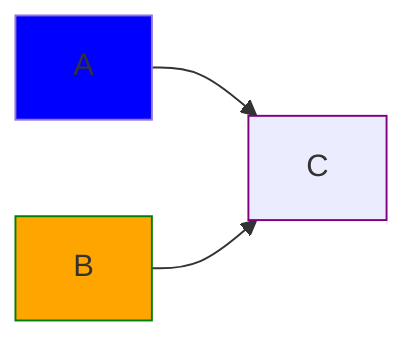
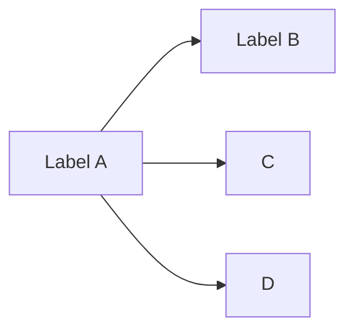

# Notes to Canvas Mapper

Convert structured notes and simple flowchart syntax into visual Obsidian Canvas maps.

Notes to Canvas Mapper helps you turn long notes, AI-generated plans, feature lists, grouped ideas, and simple graph relationships into editable Obsidian Canvas layouts. The plugin is meant to create a useful starting Canvas quickly; you can then rearrange, resize, recolor, and refine the Canvas manually.

---

## Ways to use the plugin

### Option 1: Use the ribbon icon

Click the **workflow icon** in Obsidian's left ribbon.

The icon uses smart behavior:

- If text is selected in the current note, the plugin generates a Canvas from the selected text.
- If no text is selected, the plugin generates a Canvas from the whole current note.
- If the selected text or note contains supported flowchart syntax, the plugin uses Flowchart Syntax Mode.
- Otherwise, it uses the normal structured note outline mode.

### Option 2: Use the Command Palette

Open the Command Palette:

- Windows/Linux: `Ctrl + P`
- macOS: `Cmd + P`

Then search for one of the plugin commands, such as:

- **Generate Canvas from Current Note**
- **Generate Canvas from Selected Text**

---

## Two supported input modes

Notes to Canvas Mapper currently supports two practical input styles:

1. **Outline Mode** — best for structured notes, plans, and AI-generated outlines.
2. **Flowchart Syntax Mode** — best for more complex node networks and cross-links.

---

# 1. Outline Mode

Outline Mode works best with a simple Markdown structure.

## Recommended format

```md
# My Game Project

## Characters
- Hero
  - Movement
  - Combat
  - ![[hero.png]]
- Enemy
  - Melee
  - Ranged

## UI
- Main Menu
- Health Bar
- Inventory

## Future Ideas
- Skill Tree
- Crafting
- Quest Log
```

## Supported outline structure

Use:

- one `# Title` for the map title
- `## Section` headings for major groups
- `-` dash bullets for items
- indented `-` bullets for child items
- optional image embeds such as `![[image.png]]` or ``

## Best practices for outline mode

Do:

- keep each bullet to one clear idea
- group related ideas under `##` headings
- use consistent indentation for child items
- use dash bullets for the most reliable results

Avoid:

- long unstructured paragraphs
- random heading jumps
- mixed outline styles
- inconsistent indentation
- numbered, alphabetic, or Roman numeral lists when you expect predictable Canvas output 

## What happens after generation

When the plugin runs, it creates a new `.canvas` file in your vault and opens it in Obsidian. The generated canvas can then be adjusted manually if you want to improve spacing, move nodes, or rearrange groups.

## Screenshots

**Markdown note sample**


**Command Palette**


**Graph generated on the canvas from notes**


**Plugin icon shown in the red box**


## Images

Supported embed patterns include:

```md

![[hero.png]]
```

If the referenced file exists in the vault and resolves correctly, the plugin can create an image/file node for it.

---

## Not supported yet

These are not guaranteed to produce reliable hierarchy:

- numbered lists like `1. item`
- alphabetic lists like `a. item`
- Roman numerals like `i. item`
- mixed outline styles in the same section

So yes, for consistency, users should follow a recommended structure. The plugin needs a predictable input grammar to give predictable output.

--- 

# 2. Flowchart Syntax Mode

Flowchart Syntax Mode supports a small Mermaid-compatible flowchart subset that maps cleanly to Obsidian Canvas nodes, edges, groups, and basic colors.

This is useful when your notes are no longer a simple tree and you need graph-like relationships.

## Supported flowchart headers

```mermaid
flowchart TD
flowchart TB
flowchart BT
flowchart LR
flowchart RL
graph TD
graph TB
graph BT
graph LR
graph RL
```

Direction is used as a layout hint:

- `TD` / `TB` = top-down
- `BT` = bottom-top
- `LR` = left-right
- `RL` = right-left

The plugin generates a clean starting layout. Complex graphs may still need manual adjustment in Canvas.

## Basic node and edge syntax



This becomes editable Canvas nodes and edges.

## One source to many targets



This expands to:

- Hero → Movement
- Hero → Combat
- Hero → Inventory

## Many sources to one target



This expands to:

- Hero → Combat System
- Enemy → Combat System

## Many sources to many targets



This expands to:

- Hero → Combat
- Hero → Damage System
- Enemy → Combat
- Enemy → Damage System

## Subgraphs

Subgraphs become Canvas groups.



Subgraph directions are treated as layout hints. Cross-subgraph links may still require manual cleanup in Canvas.

## Basic class color styling

The plugin supports simple `classDef` usage for node colors.



Current color behavior:

- `fill` is preferred for node color.
- `stroke` is used as a fallback if no fill exists.
- Styling is approximate because Obsidian Canvas does not behave like a full CSS renderer.

## Flowchart syntax intentionally not supported yet

This plugin does **not** try to support all Mermaid features.

Not officially supported in Flowchart Syntax Mode:

- sequence diagrams
- class diagrams
- state diagrams
- ER diagrams
- Gantt charts
- timelines
- pie charts
- complex Mermaid themes
- complex node shapes
- advanced link styling
- click callbacks
- full Mermaid rendering behavior

The goal is not to replace Mermaid. The goal is to generate editable Canvas nodes and edges from a simple flowchart-like syntax.

---

# Recommended AI prompt

Use this when asking an AI to generate notes for the plugin:

```txt
Format this for Notes to Canvas Mapper:
- Use one # Title
- Use ## section headings for major groups
- Use - dash bullets for items
- Use indented - bullets for child items
- Keep each bullet to one clear idea
- Avoid tables, numbered lists, and long paragraphs
- Output only the structured outline
```

For complex graph networks, use this:

```txt
Format this as simple flowchart syntax for Notes to Canvas Mapper:
- Use flowchart TD, TB, BT, LR, or RL
- Use node labels like A[Readable Label]
- Use arrows like A --> B
- Use & when one node connects to many nodes or many nodes connect to one node
- Use subgraph blocks only for major groups
- Use simple classDef fill or stroke colors if needed
- Avoid advanced Mermaid syntax
- Output only the flowchart block
```

# Troubleshooting

## Canvas is generated but spacing is imperfect

The plugin creates a starting layout. For complex graphs, use Obsidian Canvas to manually adjust placement.

## Image block says file could not be found

Make sure the image exists in the vault at the referenced path. You can also drag and drop the image into Canvas manually.

## Output looks too flat

Use nested bullets in Outline Mode, or use Flowchart Syntax Mode if the content is really a graph network.

## Flowchart syntax does not parse correctly

Keep the syntax simple:



Avoid advanced Mermaid syntax.

## Plugin loads but nothing appears

Use the ribbon icon in the left sidebar or the Command Palette.

- Clicking the ribbon icon uses the current note.
- If text is selected, the ribbon icon uses the selected text instead.
- The plugin does not open a separate panel. It generates a canvas file when you run it.

## Output is messy

The note is probably too unstructured. Break it into:

- one root title
- section headings
- bullet groups
- nested bullets where needed

# Summary

Notes to Canvas Mapper is designed to create useful editable Canvas starter maps from:

- structured Markdown notes
- selected text
- simple flowchart syntax

It is not meant to replace full diagramming tools. It is meant to save time by creating the first visual structure quickly, so you can finish arranging and refining directly inside Obsidian Canvas.

## Updates in v2.0.0

### Added

- Simple Flowchart Mode for Mermaid-style flowchart syntax
- Support for `flowchart` and `graph` directions: TD, TB, BT, LR, RL
- Support for node labels such as `A[Hero]`
- Support for shorthand edge expansion using `&`
- Support for subgraphs as Canvas groups
- Basic `classDef` color support

### Improved

- Better Canvas grouping for complex visual maps
- Better parsing of compact flowchart syntax, such as `A[Here] -->B[There]`
- Better label handling when a node appears first as an ID/class reference and later with a readable label

## Note

This is not full Mermaid support. Flowchart Mode supports a focused Mermaid-compatible subset that maps cleanly to Obsidian Canvas.
